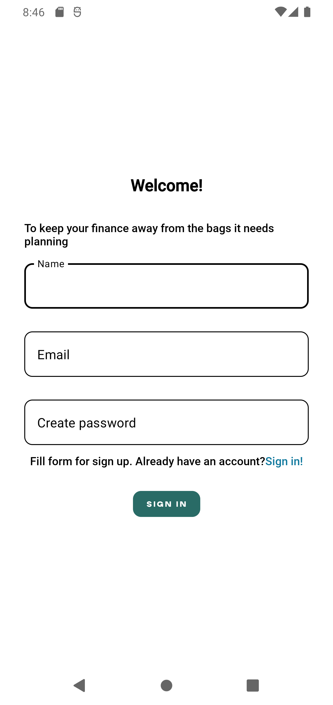
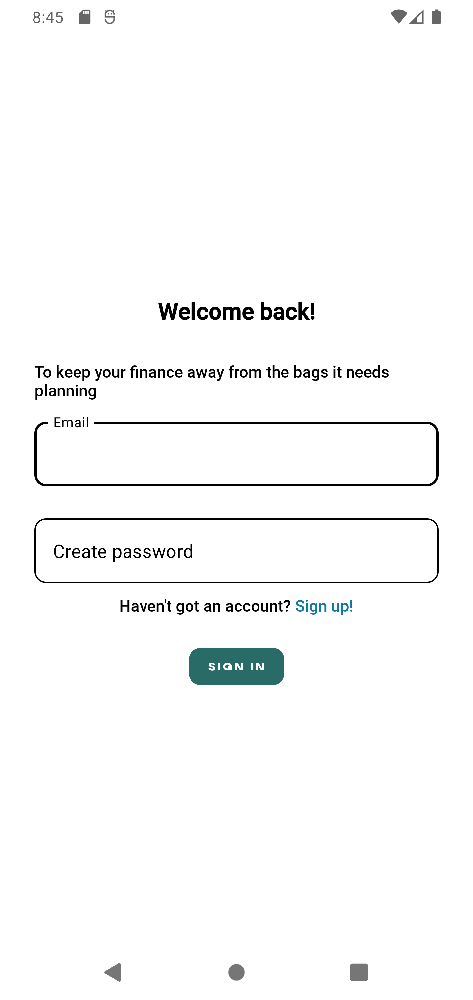
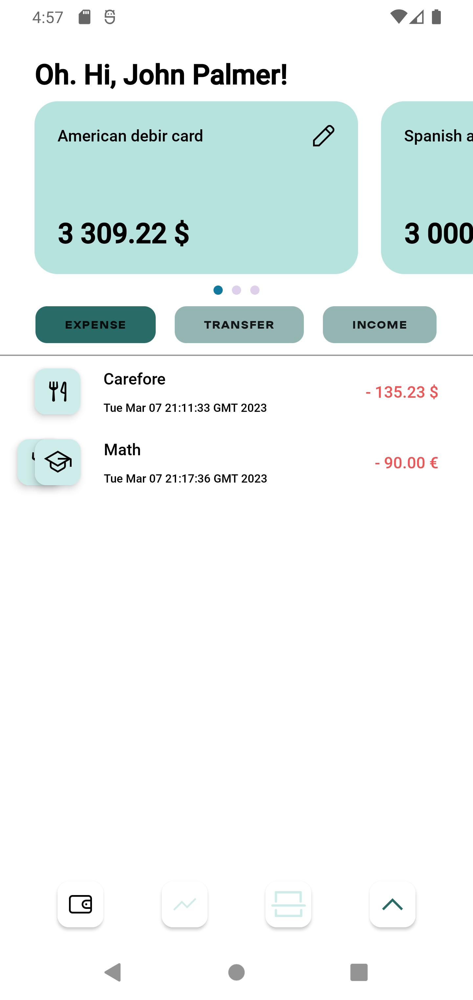
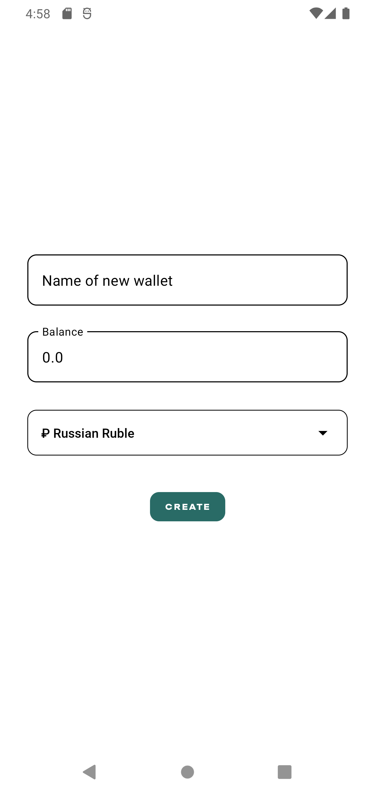
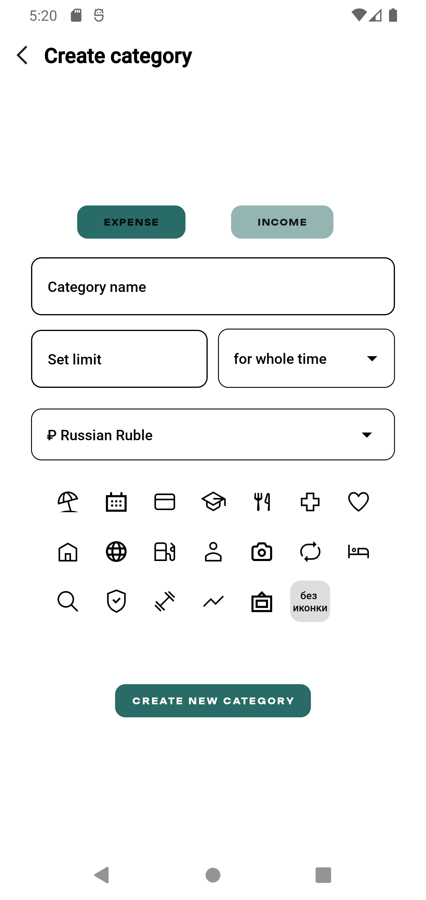
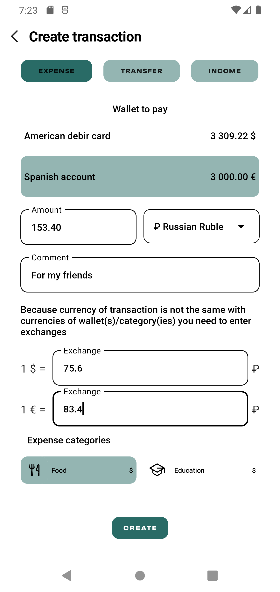

# Registration
Registarte with your email and password. You will receive an email with a link to confirm your email address. After that you can login with your email and password.

# Authorization
You can authorize with your email and password. You will receive an access token. You can use this token to access the API.

# Home page
You can see your wallets and your transactions bounded at your wallets. You can also create a new wallets and transactions.

# Wallets create
You can create a new wallet. You can choose a name and a currency.

# Statistics
You can see your statistics. You can see your total balance and your total balance in USD.

# Category create
You can create a new category. You can choose a name and a type.

# Transaction create
You can create a new transaction. You can choose a wallet, a category, a type, a description and an amount.

Also you can more over another functions.