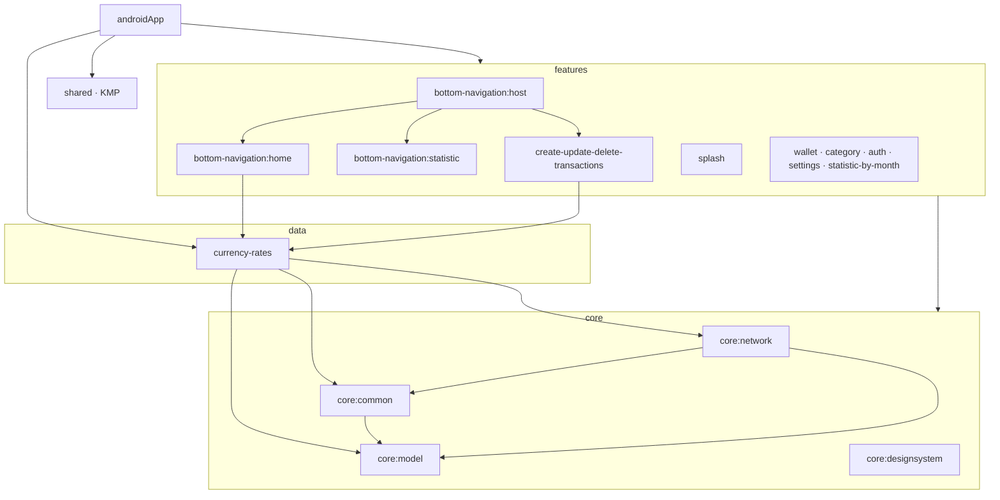

# Budget

[](https://github.com/VolovatovTA/Budget/actions/workflows/build.yaml)
[](https://github.com/VolovatovTA/Budget/actions/workflows/test.yaml)


Android app for tracking personal finances: wallets in different currencies, income and
expense transactions, categories and spending statistics.

## Tech stack

- Kotlin, Coroutines, Kotlin Multiplatform `shared` module
- Jetpack Compose, Navigation Compose
- Koin for dependency injection
- Retrofit + kotlinx.serialization, Room
- Multi-module Gradle build with convention plugins (`build-logic`) and a version catalog

## Project structure

| Module | Purpose |
|---|---|
| `androidApp` | Application module: DI wiring, navigation, build flavors |
| `features/*` | Feature modules: auth, home, statistics, wallets, categories, transactions, settings |
| `core/network` | Retrofit API interfaces, DTOs, mappers and mock implementations |
| `core/common` | Auth interceptor and token storage, data entities, error logging, utilities |
| `core/model` | Currencies: `BudgetCurrencyEnum`, flags, formatting |
| `core/designsystem` | Design system: Compose components, theme, icons |
| `shared` | Kotlin Multiplatform module |

## Module graph

Four layers, dependencies only point downwards. The picture is the summary; the rules
below are what is actually enforced.



An arrow into the `core` box means "into some of its modules": every feature uses
`core:common` and `core:designsystem`, most also `core:network` and `core:model`. The edges
of `currency-rates` and the feature-to-feature edges are drawn one by one. `scripts/module-graph.sh` prints every real edge if you need
the full picture.

### Rules

The graph is checked, not just drawn. `./gradlew assertModuleGraph` (also part of `check`
and of the CI test workflow) fails the build when a `project(...)` dependency breaks one of
the rules in the root `build.gradle.kts`:

- `androidApp` may depend on anything; nothing may depend on it.
- A feature may depend on `core:*` and on the
  `currency-rates` data module, not on other features. `bottom-navigation:host` is the one
  explicit exception: it hosts the tab screens.
- `core:*` never depends on features, and `core:designsystem` depends on nothing in the project.
- Inside the core the order is `network → common → model`.
- The longest path is capped at 6 modules (today: app → host → home → currency-rates →
  network → common → model).

Things the graph makes visible:

- `bottom-navigation:host` is the only feature that depends on other features.
- `currency-rates` is a data module (Room, no UI) that `home` and the transactions feature read from. It sits
  between the features and the core because it needs `core:network`.
- `core:designsystem` is a leaf: it depends on nothing in the project, so a visual change
  never touches business code and the other way round.
- `transaction-detail` is in the build but nothing depends on it: `androidApp` does not
  include it.
- `shared` (Kotlin Multiplatform) has no dependencies on the rest of the project yet.

## Build

The app has two flavors: `localMock` works offline on bundled mock responses, `remoteBack`
talks to the real backend. Build types and flavors contribute their own Koin modules
(`buildTypeModules`, `flavorModules`), so the DI graph is verified for every variant.

```
./gradlew :androidApp:assembleLocalMockDebug
./gradlew :androidApp:testLocalMockDebugUnitTest
```

Any JDK can launch `./gradlew`: the build itself runs on JDK 17. `gradle/gradle-daemon-jvm.properties`
pins the daemon JVM and the `jdk` entry of the version catalog pins the toolchain every module
compiles with; a missing JDK is downloaded by the foojay resolver. `./gradlew updateDaemonJvm
--jvm-version=<n>` plus the catalog entry is the whole procedure for moving to a newer JDK.

The `remoteBack` flavor reads the exchangerate-api key from the `exchangeRateApiKey` Gradle property or the
`EXCHANGE_RATE_API_KEY` environment variable.

Unit tests cover two things that used to break silently: a Koin `verify()` check fails if any
class in the DI graph has an unregistered dependency, and a mock-assets test fails if a bundled
mock response no longer matches its response class. CI runs the tests and a debug build on every
pull request.

## Screenshots

Taken from the `localMock` build.

| Sign in | Sign up | Home | Statistics |
|---|---|---|---|
|  |  |  |  |

| New transaction | New category | Edit wallet | Settings |
|---|---|---|---|
|  |  |  |  |
