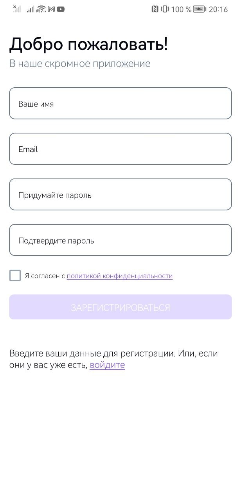
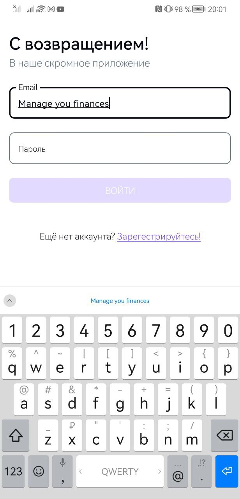
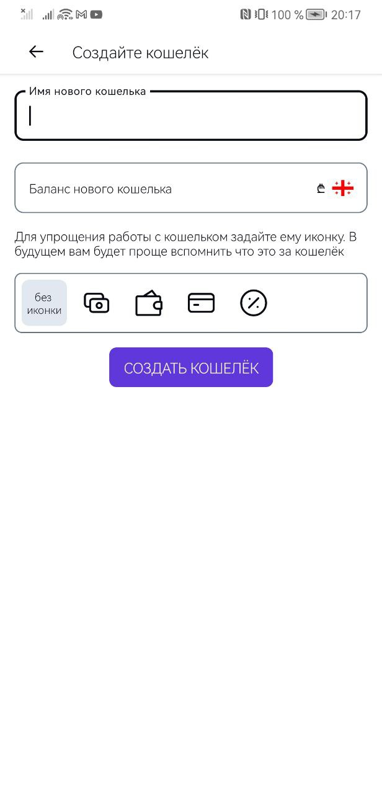
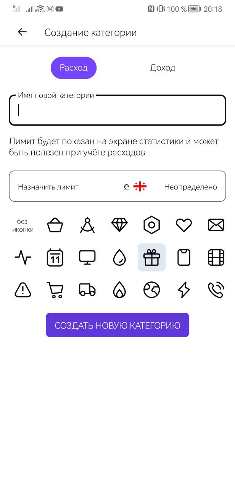
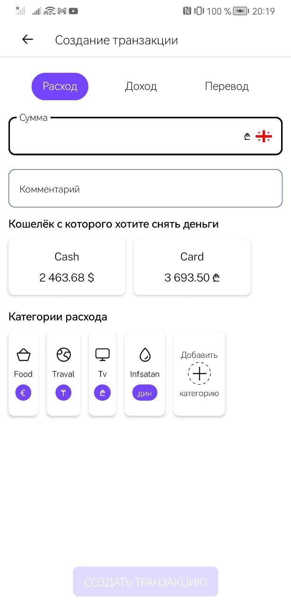

# Budget

Android app for tracking personal finances: wallets in different currencies, income and
expense transactions, categories and spending statistics.

## Tech stack

- Kotlin 2.2, Coroutines, Kotlin Multiplatform `shared` module
- Jetpack Compose, Navigation Compose
- Koin for dependency injection
- Retrofit + kotlinx.serialization, Room
- Multi-module Gradle build with convention plugins (`build-logic`) and a version catalog

## Project structure

| Module | Purpose |
|---|---|
| `androidApp` | Application module: DI wiring, navigation, build flavors |
| `features/*` | Feature modules: auth, home, statistics, wallets, categories, transactions, settings |
| `api` | Network API interfaces, DTOs, mappers and mock implementations |
| `common`, `currency` | Shared utilities, error handling, currency formatting |
| `uikit` | Design system: Compose components, theme, icons |
| `shared` | Kotlin Multiplatform module |

## Build

The app has two flavors: `localMock` works offline on bundled mock responses, `remoteBack`
talks to the real backend.

```
./gradlew :androidApp:assembleLocalMockDebug
./gradlew :androidApp:testLocalMockDebugUnitTest
```

The `remoteBack` flavor is being migrated from Hilt to Koin and does not build yet. It reads the
exchangerate-api key from the `exchangeRateApiKey` Gradle property or the
`EXCHANGE_RATE_API_KEY` environment variable.

The unit tests include a Koin `verify()` check that fails if any class in the DI graph has an
unregistered dependency. CI runs the tests and a debug build on every pull request.

# Screenshots

## Registration
Register with your email and password. You will receive an email with a link to confirm your email address. After that you can login with your email and password.

## Authorization
You can authorize with your email and password. You will receive an access token. You can use this token to access the API.

## Home page
You can see your wallets and your transactions bounded at your wallets. You can also create a new wallets and transactions.

## Wallets create
You can create a new wallet. You can choose a name and a currency.

## Statistics
You can see your statistics. You can see your total balance and your total balance in USD.

## Category create
You can create a new category. You can choose a name and a type.

## Transaction create
You can create a new transaction. You can choose a wallet, a category, a type, a description and an amount.

