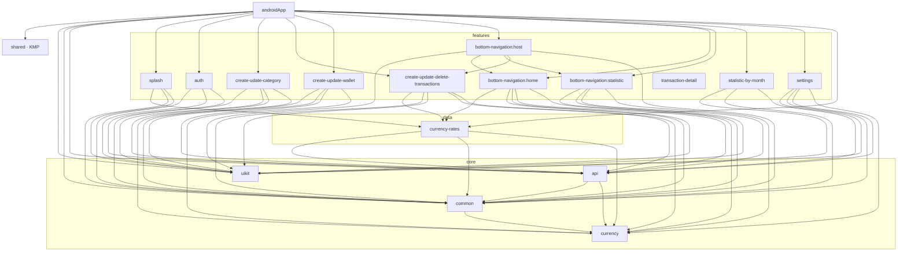

# Budget

[](https://github.com/VolovatovTA/Budget/actions/workflows/build.yaml)
[](https://github.com/VolovatovTA/Budget/actions/workflows/test.yaml)


Android app for tracking personal finances: wallets in different currencies, income and
expense transactions, categories and spending statistics.

## Tech stack

- Kotlin, Coroutines, Kotlin Multiplatform `shared` module
- Jetpack Compose, Navigation Compose
- Koin for dependency injection
- Retrofit + kotlinx.serialization, Room
- Multi-module Gradle build with convention plugins (`build-logic`) and a version catalog

## Project structure

| Module | Purpose |
|---|---|
| `androidApp` | Application module: DI wiring, navigation, build flavors |
| `features/*` | Feature modules: auth, home, statistics, wallets, categories, transactions, settings |
| `api` | Network API interfaces, DTOs, mappers and mock implementations |
| `common`, `currency` | Shared utilities, error handling, currency formatting |
| `uikit` | Design system: Compose components, theme, icons |
| `shared` | Kotlin Multiplatform module |

## Module graph

Four layers, dependencies only point downwards. Every arrow is a real `project(...)`
dependency from a build script; `scripts/module-graph.sh` regenerates the diagram.



Things the graph makes visible:

- `bottom-navigation:host` is the only feature that depends on other features: it hosts
  `home`, `statistic` and the transactions screen.
- `currency-rates` is a data module (Room, no UI) that three features read from. It sits
  between the features and the core because it needs `api`.
- `uikit` is a leaf: it depends on nothing in the project, so it can change without
  touching business code and the other way round.
- `transaction-detail` has no incoming edges: `androidApp` does not include it.
- `shared` (Kotlin Multiplatform) has no dependencies on the rest of the project yet.

## Build

The app has two flavors: `localMock` works offline on bundled mock responses, `remoteBack`
talks to the real backend. Build types and flavors contribute their own Koin modules
(`buildTypeModules`, `flavorModules`), so the DI graph is verified for every variant.

```
./gradlew :androidApp:assembleLocalMockDebug
./gradlew :androidApp:testLocalMockDebugUnitTest
```

The `remoteBack` flavor reads the exchangerate-api key from the `exchangeRateApiKey` Gradle property or the
`EXCHANGE_RATE_API_KEY` environment variable.

Unit tests cover two things that used to break silently: a Koin `verify()` check fails if any
class in the DI graph has an unregistered dependency, and a mock-assets test fails if a bundled
mock response no longer matches its response class. CI runs the tests and a debug build on every
pull request.

## Screenshots

Taken from the `localMock` build.

| Sign in | Sign up | Home | Statistics |
|---|---|---|---|
|  |  |  |  |

| New transaction | New category | Edit wallet | Settings |
|---|---|---|---|
|  |  |  |  |
